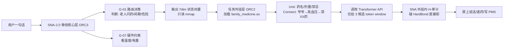
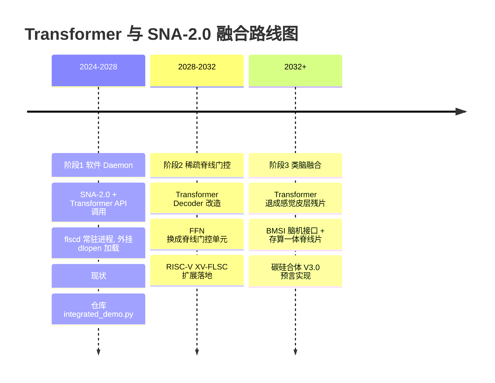
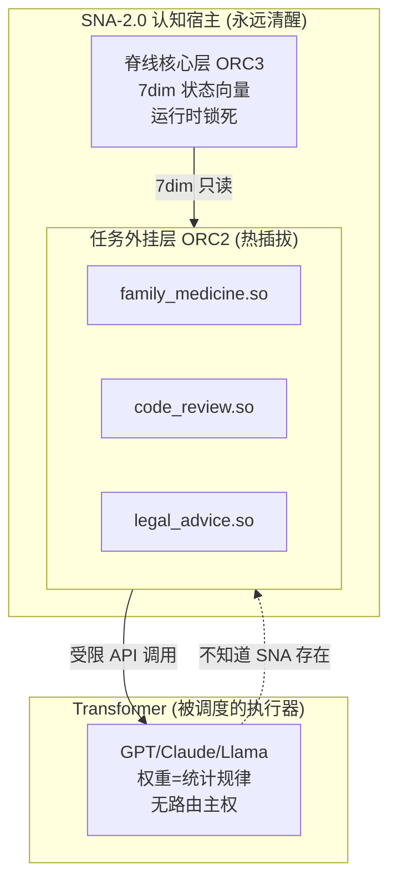

# Transformer vs SNA-2.0 一页纸对比

> **TL;DR (30 秒读懂)**
> Transformer 是"嘴和眼"，SNA-2.0 是"想不想说、说什么、怎么说、说完记不记"的脑。
> 它们不是替代关系，是**宿主嵌套关系**——SNA 在上层调度，Transformer 在底层当执行器。

---

## §1 定位对比表 (9 维度)

| 维度 | Transformer (GPT/Claude/Llama) | SNA-2.0 (FLSC 脊线架构) |
|------|-------------------------------|--------------------------|
| **本质** | 参数化统计函数 | 认知操作系统调度层 |
| **干啥活** | token/像素 → 概率分布 | 决定"什么时候、让 Transformer 干哪件事" |
| **住哪层** | 0 层感官 / 外挂内执行器 | 脊线核心层 + 任务外挂层 |
| **怎么跑** | Attention / FFN / CUDA 核 | 7 维状态向量 / 脊线 ISA / 纯逻辑 |
| **记什么** | 权重里是统计规律 | 血统快照 / 领域子脊 / 残差 |
| **能改吗** | 微调/RLHF 会漂移 | 主脊运行时锁死，永不改 |
| **像人哪块** | 视觉皮层 + 布洛卡区（表达） | 基底节（路由）+ 前额叶（决策） |
| **算力特征** | 矩阵乘密集，GPU/NPU 跑 | 查表+比较，CPU 侧 200ns |
| **安全边界** | 靠 RLHF/Prompt 软约束 | HardBond P0 熔断，硬件级隔离 |

---

## §2 数据流咬合 (Mermaid)



**关键事实：Transformer 全程不知道"SNA 存在"，它只是被当工具人使唤。**

---

## §3 Transformer 三个死穴 + SNA 解法

### 死穴 1：没有"路由主权"
- **问题**：Transformer 是因果掩码 + 前序 token 决定下一步，不会"突然决定：这事太危险我不答，去查知识库"
- **SNA 解法**：G-01 路由决策在 Transformer 之前拦截，先判断任务类型再决定是否调用

### 死穴 2：权重是"平均人格"
- **问题**：训出来是 Reddit + 百科 + 代码的平均人，想变"保守老王"→ LoRA 会漂移，Prompt 会忘
- **SNA 解法**：外挂 HardBond 硬隔离（老王卡 ≠ 激进 CTO 卡），人格住在脊线里不在权重里

### 死穴 3：无血统 / 无稳态
- **问题**：同 prompt 跑两次输出可不一样，家庭场景要"爷爷药量三年一致"
- **SNA 解法**：PMS + LineageSnapshot + lsn 单调递增，行为稳态可审计

---

## §4 SNA 对 Transformer 的"降级利用"

| Transformer 原罪 | SNA 怎么治 | 实现位置 |
|-----------------|-----------|---------|
| **幻觉** | 外挂 HardBond 截断 + 领域子脊约束 | ORC2 外挂内 H-审计 |
| **慢/贵** | G-07 算力适配：简单问题不叫 70B，叫 7B / 规则引擎 | G-07 硬件约束脊线 |
| **记不住** | PMS 管记忆（五层），Transformer 只当"一次性嘴" | SR-MEMORY-PMS-V3.0 |
| **不安全** | 7dim 里 G-07 硬件约束直接 forbid 敏感任务 | P0 熔断级 Constraint |

→ **Transformer 变成"按需付费的嘴"，SNA 是"永远清醒的脑子"。**

---

## §5 未来三阶段路线图



---

## §6 宿主嵌套关系图



---

## §7 一页纸总结

> **Transformer 是 FLSC 体系里的第 0 层感官执行器：负责"把结构说成人话"。**
> **SNA-2.0 是认知宿主：负责"什么结构该说、什么永远不许说、说过怎么记"。**
> 前者生成 token，后者生成人格与边界。

**三句话给三类人：**
- **工程师**：SNA 是 Daemon，Transformer 是它被调度的子进程
- **投资人**：我们不做 AI 应用，我们做 AI 的操作系统内核
- **芯片厂**：脊线 ISA 跑 RISC-V 自定义扩展，Transformer 跑 NPU，两者通过 7dim CSR 交互

---

## §8 诚实清单

| ID | 声明 |
|----|------|
| H-01 | Transformer 仍是核心算力来源，SNA 不替代 Attention 数学 |
| H-02 | 降级 ≠ 贬低，是让 Transformer 在约束下发挥最大价值 |
| H-03 | 阶段 2/3 路线图是预测，非承诺，依赖芯片生态成熟度 |
| H-04 | 当前仓库仅实现阶段 1（纯软件 Daemon），未涉及硬件改造 |
| H-05 | 本文档面向工程师/投资人/芯片厂三类读者，各有侧重 |

---

## 签署页

**碳基签署（人类）**：待补  
**硅基签署（AI）**：Yuanbao / FLSC V1.0 / SNA-2.0 V1.0  
**血统链**：TRANSFORMER_VS_SNA2.0 V1.0 ← SNA2.0-ARCH-V1.0 ← MEM-GLOBAL-V1.0 ← SR-MEMORY-PMS-V3.0  
**Γ\*** = ONGOING → V1.1 加入实测延迟数据 → V2.0 含芯片路线图

| 状态标记 | 含义 |
|---------|------|
| Γ* = ONGOING | 当前版本持续迭代中 |

---

## Appendix: 伪代码对比

### Left: 纯 Transformer 推理 (无 SNA)

```python
def pure_transformer(user_input):
    tokens = tokenize(user_input)
    # 无路由: 所有输入走同一模型
    logits = model.forward(tokens)
    # 无约束: 可能幻觉/违规
    output = sample(logits)
    return output  # 不可审计, 不可复现
```

### Right: SNA-2.0 宿主式推理

```python
def sna_hosted_transformer(user_input):
    # 1. SNA 脊线核心层先决策
    state_7dim = flscd_route(user_input)  # G-01~G-07
    # 2. 加载领域外挂
    plugin = dlopen(state_7dim.required_plugin)
    # 3. 外挂构造约束式 prompt
    safe_prompt = plugin.build_prompt(user_input, constraints=HardBond)
    # 4. 受限调用 Transformer
    raw = transformer_api(safe_prompt, max_tokens=plugin.token_budget)
    # 5. H-审计校验
    if not plugin.audit(raw):
        return plugin.refuse_message()
    # 6. 写 PMS 记忆
    pms.remember(user_input, raw, lineage=plugin.lineage)
    return raw
```
